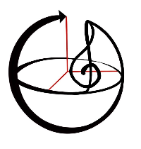

 
# Quantum Futures Hackathon 2019
## Humanizing Quantum - PianQ

Generating quantum music using Qiskit. 
We have develop a platform designed to help the general public understand and appreciate the main features of the quantum systems such as: superposition and basic knowledge of quantum computating. We develop the understanding of these mathematical concepts by using a musical language, using a mapping one-to-one between musical notes of an octave into single qubits.

The interactive and easy-to-use quantum piano interface built using Pygame lybrary [1], perform specific operations (e.g Hadamard gate) on a quantum computer (IBM Q)[2] or quantum simulator using QISKit[3] lybrary.The moment when the user press a key associated to one of the musical tones on the piano visible on the screen, this generates the relevant quantum logic gate on the screen that chances the state of the qubit reproducing an specific sound frequency..
The change in the volume shows and analogy of the quantum superposition between the tone sound and no sound. The volume scale  is defined from the results of the state probability histogram, where the maximum volume will be at |1> and minimum volume (i.e. no sound) |0>, therefore any other volume intensity between will be a superposition (i.e linear combination) of the two states i.e |psi>= a|0> + b|1>, which indeed is not possible classically. 
This interactive platform is mainly designed to teach about quantum circuitry, so that when the process is reversed, they can appreciate what they are listening to. 

Finally, an audio demo is perfom where a quantum algorithm is translated into music, so you can listen to what a quantum algorithm sounds like.
